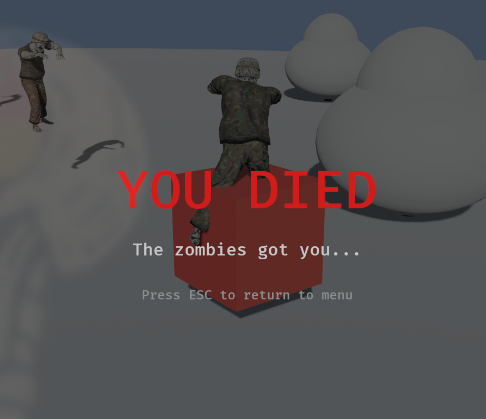
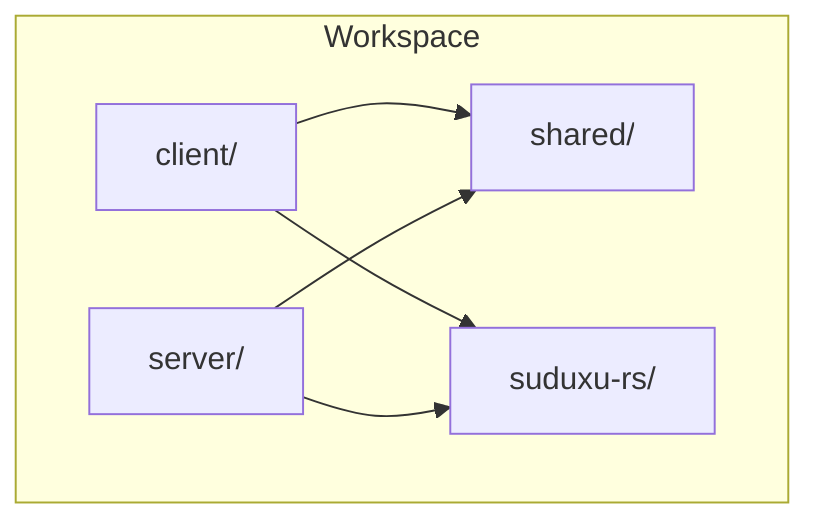
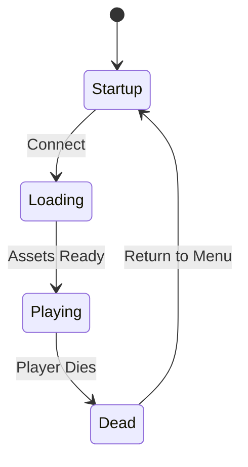
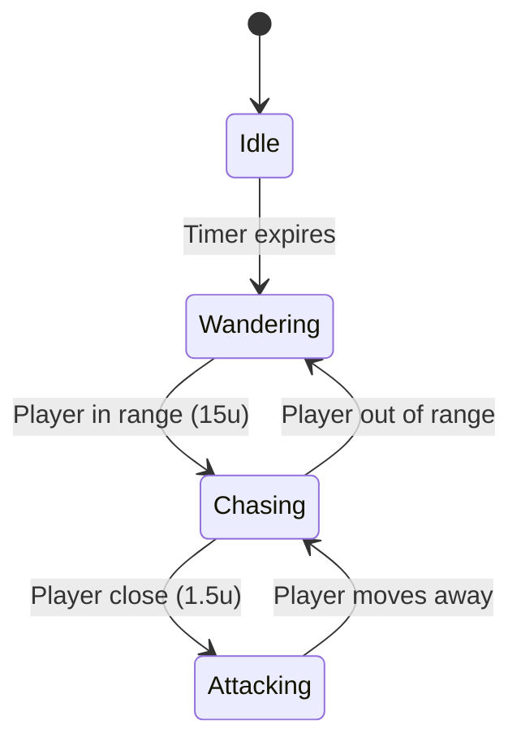
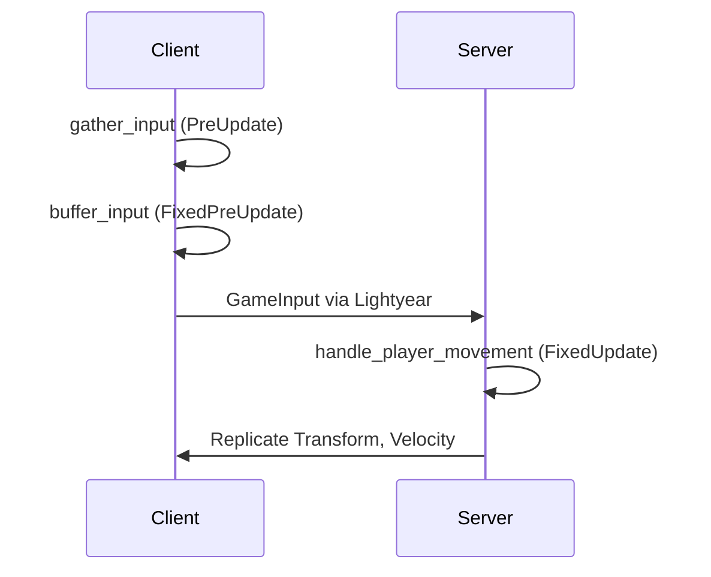
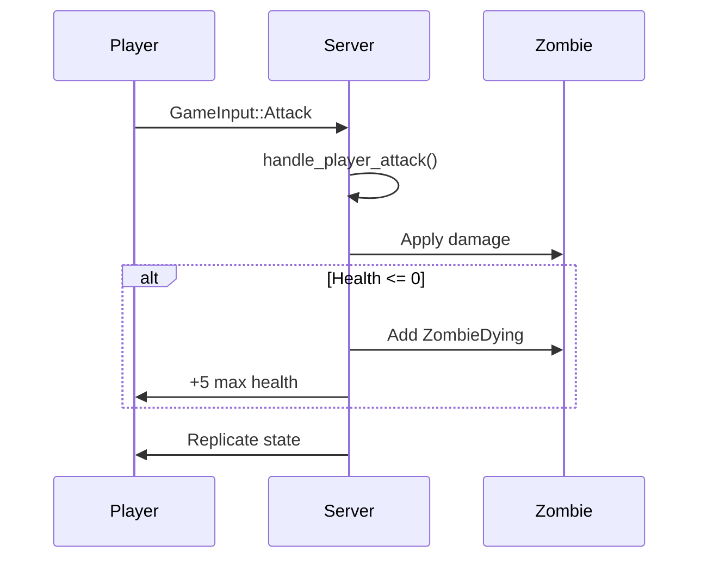

# Zombrise Architecture

A 3D multiplayer zombie survival game built with **Bevy** (game engine),
**Lightyear** (networking), and **Avian3D** (physics).



## Overview



The project is a Cargo workspace with four crates:

| Crate         | Description                                                           |
| ------------- | --------------------------------------------------------------------- |
| **shared**    | Common protocol, components, and logic used by both client and server |
| **client**    | Game client with rendering, UI, camera, and player input              |
| **server**    | Authoritative server with zombie AI, combat, and world management     |
| **suduxu-rs** | External library bindings for input handling                          |

---

## Tech Stack

| Technology                                                    | Purpose                                   |
| ------------------------------------------------------------- | ----------------------------------------- |
| [Bevy](https://bevyengine.org/)                               | Game engine with ECS architecture         |
| [Lightyear 0.25](https://github.com/cBournhonesque/lightyear) | Networking with client-side prediction    |
| [Avian3D](https://github.com/Jondolf/avian)                   | Physics engine (collisions, rigid bodies) |
| [UDP/Netcode](https://github.com/networkprotocol/netcode)     | Transport layer for multiplayer           |

---

## Shared Crate (`shared/src/`)

Contains all code shared between client and server for consistency.

### Key Files

| File                                                                                     | Purpose                                             |
| ---------------------------------------------------------------------------------------- | --------------------------------------------------- |
| [lib.rs](file:///home/benjaminf/Documents/dev/game/zombrise/shared/src/lib.rs)           | Module exports                                      |
| [protocol.rs](file:///home/benjaminf/Documents/dev/game/zombrise/shared/src/protocol.rs) | Networking protocol (inputs, channels, replication) |
| [shared.rs](file:///home/benjaminf/Documents/dev/game/zombrise/shared/src/shared.rs)     | SharedPlugin and component registration             |
| [entity2.rs](file:///home/benjaminf/Documents/dev/game/zombrise/shared/src/entity2.rs)   | Health component                                    |

### Protocol (`protocol.rs`)

Defines the Lightyear networking protocol:

```rust
// Input types sent from client to server
pub enum GameInput {
    Move { direction: Vec2, yaw: f32 },
    Attack,
    None,
}

// Reliable ordered channel
pub struct GameChannel;
```

**Component Replication:**

- `Player`, `PlayerOwner` - With prediction enabled
- `Transform`, `LinearVelocity`, `Position`, `Rotation` - Predicted for smooth
  movement
- `Health`, `Zombie`, `ZombieAnimationState` - Server-authoritative

### Players Module (`players/`)

| File                                                                                                             | Purpose                        |
| ---------------------------------------------------------------------------------------------------------------- | ------------------------------ |
| [player.rs](file:///home/benjaminf/Documents/dev/game/zombrise/shared/src/players/player.rs)                     | Player components and movement |
| [player_animation.rs](file:///home/benjaminf/Documents/dev/game/zombrise/shared/src/players/player_animation.rs) | Animation handling             |

**Key Components:**

- `Player` - Marker component for player entities
- `PlayerOwner(u64)` - Client ID that owns this player
- `Health { current, max }` - Health tracking
- `DamageFlash { timer }` - Visual damage feedback

**Movement System:**

```rust
// Shared between client (prediction) and server (authority)
fn handle_player_movement(
    query: Query<(&mut LinearVelocity, &mut Transform, &ActionState<GameInput>), With<Player>>,
) { ... }
```

### Zombie Module (`zombie/`)

| File                                                                                        | Purpose                              |
| ------------------------------------------------------------------------------------------- | ------------------------------------ |
| [zombie.rs](file:///home/benjaminf/Documents/dev/game/zombrise/shared/src/zombie/zombie.rs) | Zombie components, animations, state |

**Key Components:**

- `Zombie` - Marker component
- `ZombieAnimationState` - Enum: `Idle`, `Walking`, `Running`, `Attacking`,
  `Dying`, `Hit`
- `ZombieDying { timer, fall_duration, burn_duration }` - Death sequence state
- `ZombieDamageFlash { timer }` - Visual feedback

---

## Client Crate (`client/src/`)

Handles rendering, UI, audio, and player input.

### Entry Point

[main.rs](file:///home/benjaminf/Documents/dev/game/zombrise/client/src/main.rs) -
App setup with state machine:



**App States:**

- `Startup` - Main menu, server connection UI
- `Loading` - Asset loading screen
- `Playing` - Active gameplay
- `Dead` - Death screen

### Core Modules

| File                                                                                                 | Purpose                          |
| ---------------------------------------------------------------------------------------------------- | -------------------------------- |
| [networking.rs](file:///home/benjaminf/Documents/dev/game/zombrise/client/src/networking.rs)         | Client connection, input manager |
| [audio.rs](file:///home/benjaminf/Documents/dev/game/zombrise/client/src/audio.rs)                   | Sound effects and music          |
| [physics.rs](file:///home/benjaminf/Documents/dev/game/zombrise/client/src/physics.rs)               | Client-side physics setup        |
| [startup_screen.rs](file:///home/benjaminf/Documents/dev/game/zombrise/client/src/startup_screen.rs) | Main menu UI                     |
| [loading_screen.rs](file:///home/benjaminf/Documents/dev/game/zombrise/client/src/loading_screen.rs) | Asset loading UI                 |
| [death_screen.rs](file:///home/benjaminf/Documents/dev/game/zombrise/client/src/death_screen.rs)     | Death/respawn UI                 |
| [snowflakes.rs](file:///home/benjaminf/Documents/dev/game/zombrise/client/src/snowflakes.rs)         | Particle effects                 |

### Game Module (`game/`)

| File                                                                                                      | Purpose                       |
| --------------------------------------------------------------------------------------------------------- | ----------------------------- |
| [camera.rs](file:///home/benjaminf/Documents/dev/game/zombrise/client/src/game/camera.rs)                 | Third-person camera           |
| [player_visuals.rs](file:///home/benjaminf/Documents/dev/game/zombrise/client/src/game/player_visuals.rs) | Player model and animations   |
| [zombie_visuals.rs](file:///home/benjaminf/Documents/dev/game/zombrise/client/src/game/zombie_visuals.rs) | Zombie model and animations   |
| [world_visuals.rs](file:///home/benjaminf/Documents/dev/game/zombrise/client/src/game/world_visuals.rs)   | Map and environment rendering |
| [health_ui.rs](file:///home/benjaminf/Documents/dev/game/zombrise/client/src/game/health_ui.rs)           | Health bar overlay            |
| [fire_effects.rs](file:///home/benjaminf/Documents/dev/game/zombrise/client/src/game/fire_effects.rs)     | Fire/burn effects             |

---

## Server Crate (`server/src/`)

Authoritative game server with no rendering.

### Entry Point

[main.rs](file:///home/benjaminf/Documents/dev/game/zombrise/server/src/main.rs) -
Headless server setup:

```rust
App::new()
    .add_plugins(MinimalPlugins)  // No rendering
    .add_plugins(ServerPlugins::default())  // Lightyear
    .add_plugins(SharedPlugin)
    .add_plugins(PhysicsPlugins::default())  // Avian3D
    // ... systems
    .run();
```

### Systems Module (`systems/`)

| File                                                                                                 | Purpose                         |
| ---------------------------------------------------------------------------------------------------- | ------------------------------- |
| [networking.rs](file:///home/benjaminf/Documents/dev/game/zombrise/server/src/systems/networking.rs) | Client connection handling      |
| [combat.rs](file:///home/benjaminf/Documents/dev/game/zombrise/server/src/systems/combat.rs)         | Attack and damage processing    |
| [zombie_ai.rs](file:///home/benjaminf/Documents/dev/game/zombrise/server/src/systems/zombie_ai.rs)   | Zombie behavior and spawning    |
| [zombie.rs](file:///home/benjaminf/Documents/dev/game/zombrise/server/src/systems/zombie.rs)         | Zombie state updates            |
| [player.rs](file:///home/benjaminf/Documents/dev/game/zombrise/server/src/systems/player.rs)         | Player state (cooldowns, regen) |
| [world.rs](file:///home/benjaminf/Documents/dev/game/zombrise/server/src/systems/world.rs)           | Map and entity cleanup          |

### Combat System (`combat.rs`)

**Constants:**

```rust
pub const ATTACK_RANGE: f32 = 2.5;
pub const ATTACK_DAMAGE: f32 = 25.0;
pub const ATTACK_COOLDOWN: f32 = 0.5;
pub const DAMAGE_PER_SECOND: f32 = 10.0;  // Zombie collision damage
pub const MAX_HEALTH_BONUS_PER_KILL: f32 = 5.0;  // Reward for kills
```

### Zombie AI (`zombie_ai.rs`)



**AI Constants:**

```rust
pub const CHASE_RANGE: f32 = 15.0;
pub const ATTACK_RANGE: f32 = 1.5;
pub const MAX_ZOMBIES: usize = 50;
pub const SPAWN_INTERVAL: f32 = 20.0;
pub const SPAWN_RADIUS: f32 = 25.0;
```

---

## Data Flow

### Input Processing



### Client-Side Prediction

1. Client applies input immediately (`handle_player_movement`)
2. Server processes input authoritatively
3. Server replicates state back to client
4. Lightyear reconciles prediction with server state

### Combat Flow



---

## Running the Game

### Start Server

```bash
cargo run --bin zombrise_server
```

### Start Client

```bash
cargo run --bin client
```

### WASM Build (Client Only)

```bash
cargo build --target wasm32-unknown-unknown --bin client
```

---

## Directory Structure

```
zombrise/
├── Cargo.toml              # Workspace manifest
├── Readme.md               # Brief README
├── ARCHITECTURE.md         # This file
├── client/
│   ├── Cargo.toml
│   └── src/
│       ├── main.rs           # App entry, state machine
│       ├── networking.rs     # Network connection
│       ├── audio.rs          # Sound system
│       ├── physics.rs        # Physics setup
│       ├── startup_screen.rs # Menu UI
│       ├── loading_screen.rs # Loading UI
│       ├── death_screen.rs   # Death UI
│       ├── snowflakes.rs     # Particles
│       ├── map/              # Map loading
│       └── game/
│           ├── camera.rs         # Camera controls
│           ├── player_visuals.rs # Player rendering
│           ├── zombie_visuals.rs # Zombie rendering
│           ├── world_visuals.rs  # Environment
│           ├── health_ui.rs      # Health bar
│           └── fire_effects.rs   # Fire particles
├── server/
│   ├── Cargo.toml
│   └── src/
│       ├── main.rs           # Headless server
│       └── systems/
│           ├── networking.rs   # Client management
│           ├── combat.rs       # Damage system
│           ├── zombie_ai.rs    # AI behavior
│           ├── zombie.rs       # Zombie updates
│           ├── player.rs       # Player updates
│           └── world.rs        # World management
├── shared/
│   ├── Cargo.toml
│   └── src/
│       ├── lib.rs            # Exports
│       ├── protocol.rs       # Network protocol
│       ├── shared.rs         # SharedPlugin
│       ├── entity2.rs        # Health component
│       ├── players/
│       │   ├── player.rs         # Player logic
│       │   └── player_animation.rs
│       └── zombie/
│           └── zombie.rs         # Zombie logic
├── suduxu-rs/                # Input library bindings
├── game_audio/               # Audio assets
└── files/                    # Other assets
```
